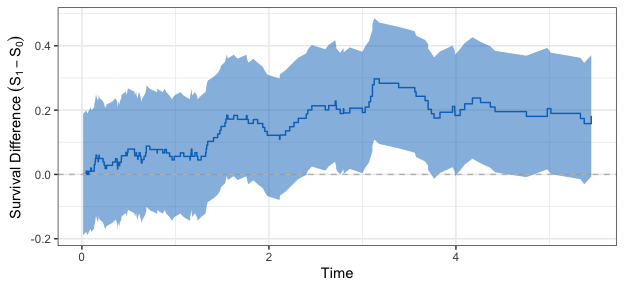

## Survival Bands
This package generates simultaneous confidence bands for a single survival curve, and for the difference of two survival curves, using the method of [Prazen et al (1997)](https://onlinelibrary.wiley.com/doi/abs/10.1111/1467-9469.t01-1-00065). 

## Compact Example


```r
library(Bands)
library(Temporal)
set.seed(2014)
data0 <- rGamma(n = 1e2, a = 1, l = 1/2, p = 0.2)
data0$arm <- 0
data1 <- rGamma(n = 1e2, a = 1, l = 1/4, p = 0.2)
data1$arm <- 1
data <- rbind(data0, data1)
ep_band <- SurvBands(
  time = data$time,
  status = data$status,
  arm = data$arm
)
show(ep_band)
```

```
## 2 Sample Survival Band.
## Significance level: 0.05 
## Critical value: 2.671 
## Sample paths: 1000 
## P-value for difference of survival curves: 0.000999
```

```r
plot(ep_band)
```



## Vignette

The vignette may be found [here](https://github.com/zrmacc/Bands/blob/master/vignettes/Vignette.pdf).
